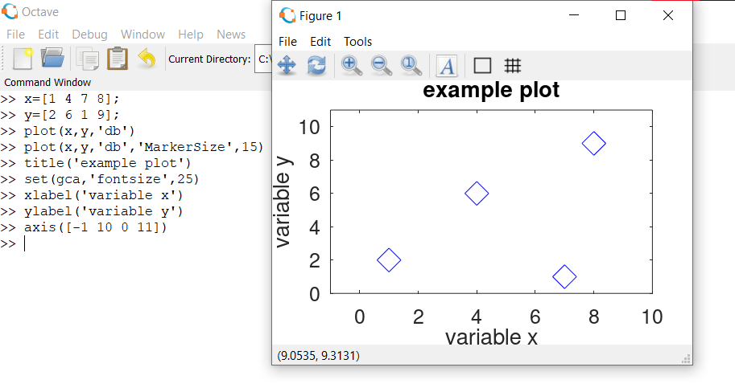

# GNU Octave

- GNU Octave is a script-based computer langugage, primarily aiming at solving algebric and differential equations.

- It has numerous built-in functions and various plotting capabilities.

- It also allows for developing user-defined functions.

- It is a free software, and highly compatible with Matlab.

### Download Octave or read the documentation:

https://www.gnu.org/software/octave/

## Help & Lookfor & doc

```
 help name
 help --list
 ```

Display the help text for name.

For example, the command help help prints a short message describing the help command.
Given the single argument --list, list all operators, keywords, built-in functions, and loadable functions available in the current session of Octave. 

```
lookfor str
lookfor -all str 
```

Search for the string str in the documentation of all functions in the current function search path.

By default, lookfor looks for str in just the first sentence of the help string for each function found. The entire help text of each function can be searched by using the "-all" argument. All searches are case insensitive. 

```
 doc function_name
 doc
```
Display documentation for the function function_name directly from an online version of the printed manual, using the GNU Info browser.

If invoked without an argument, the manual is shown from the beginning. 

## Arithmetic Operators
```
a + b //Addition
a - b //Subtraction
a*b   //Multiplication
a^b or a**b //Exponentiation
a/b //Division
```
## Variables 
- Variables are data storage space for numeric or string (or text) values.

```
whos
```


Provide detailed information on currently defined variables matching the given patterns.
Options and pattern syntax are the same as for the who command.
Extended information about each variable is summarized in a table with the following default entries. 

### Vectors 
1. Row Vector

- Creating Vector 
```
Variable name = [ element1 element2 element3... ]
```
- Note : The index begins from 1 (not zero) , for instance , Variable name[2] => element2

```
 linspace (base, limit, n)
 ```
Return a row vector with n linearly spaced elements between base and limit.

If the number of elements is greater than one, then the endpoints base and limit are always included in the range. If base is greater than limit, the elements are stored in decreasing order. If the number of points is not specified, a value of 100 is used. 

2. Column Vector

- Creating Vector 
```
Variable name = [element1; element2; element3; ... ]
```
## Matrices

- Creating Matrix
```
Variable name = [element1 element2 element3; ... ]
```
- Identity Matrix 
```
I= eye(n) // n is the size
```
- Matrix with ones m by n size (/zeros)
```
a=ones(m,n) // zeros(m,n)
ones(m) // zeros(m) m by m size
```
- Random matrix
```
 rand(m) // m by m size matrix with with random numbers between 0 and 1
 rand(m,n) // m by n size matrix with with random numbers between 0 and 1
```
- Reshape function
 Return a matrix with the specified dimensions whose elements are taken from the matrix.
 The elements of the matrix are accessed in column-major order (like
 Fortran arrays are stored).
 ```
 reshape(x,n,m) // rearrange the elements of x into n by m size matrix.
 ```
 

- Eigenvalues

 You can find eigenvalues of a matrix by using the eig() function :
 

- Combination of matrices (e.g a and b)
```
c = [a b] //row
c = [a;b] //column
```


- Element by element matrix operations
1. Multiplication of Matrices A and B  => A. *B
2. Divison  of Matrices A and B        => A. /B
3. Exponentiation of Matrices A and B  => A. ^B

- Transpose of a matrix => A => A'

## Scatter Plot


```
title('this is the title of the graph')
set(gca,'fontsize',number) 
xlabel('this text will appear below the x-axis.')
ylabel('This text will appear to the left of the y-axis.')
axis([XminXmaxYminYmax])
```


## Line Plot 

``` 
plot(x1,y1,property1,x2,y2,property2,...xn,yn,propertyn,)
```


## Script and Function

1. Scripts and functions are the collections of Octave or Matlab commands as text files with the file extension m.
2. Octave/Matlab scripts and functions are also known as a "m-file".
3. Scripts and functions can be run by "calling" from command window.
4. Often, we consider the script/function writing as Octave or Matlab programing.

### Examples

- *In editor section* exapmles of script and function

     - 
     - 
     - 

- *in Command window* running of them
  

### Source : https://www.youtube.com/watch?v=TqwSlEsbObg